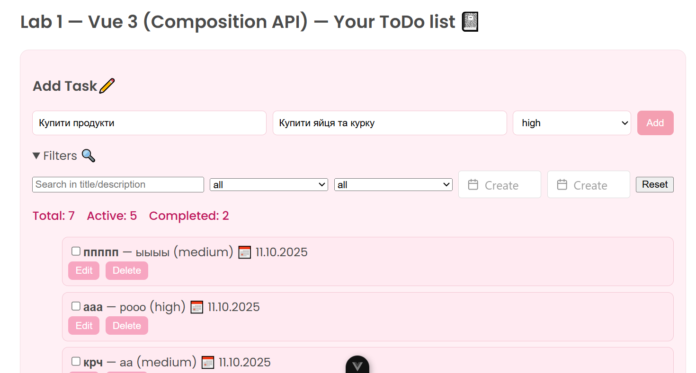
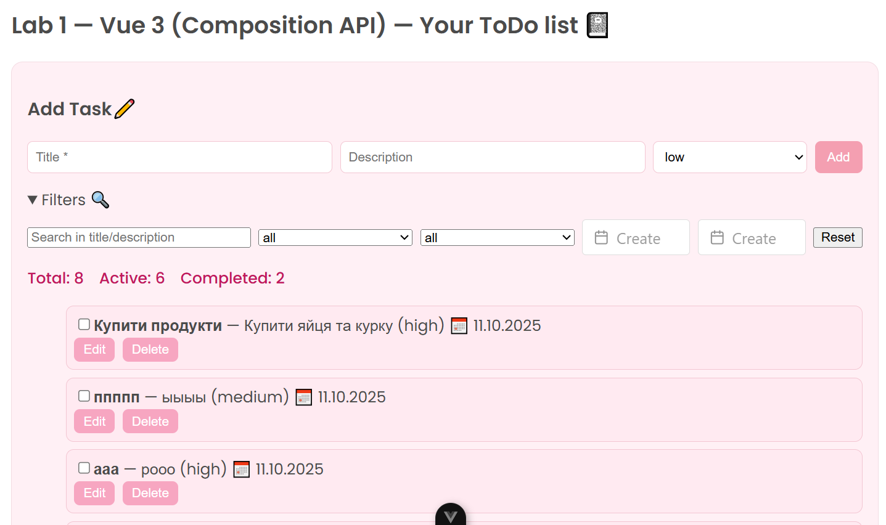
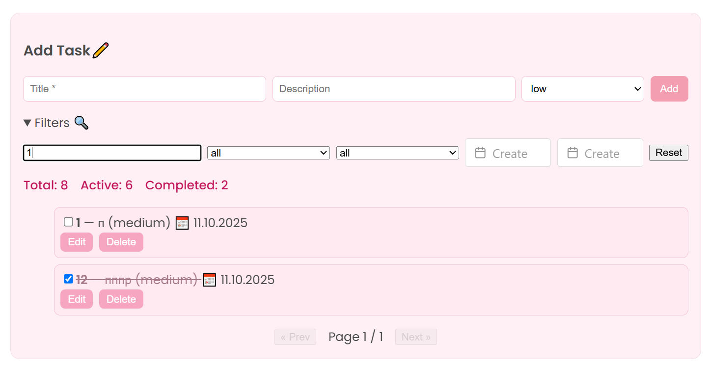
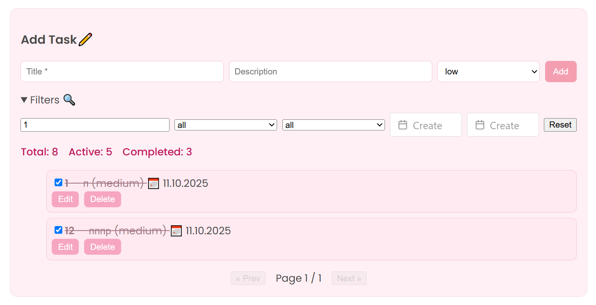
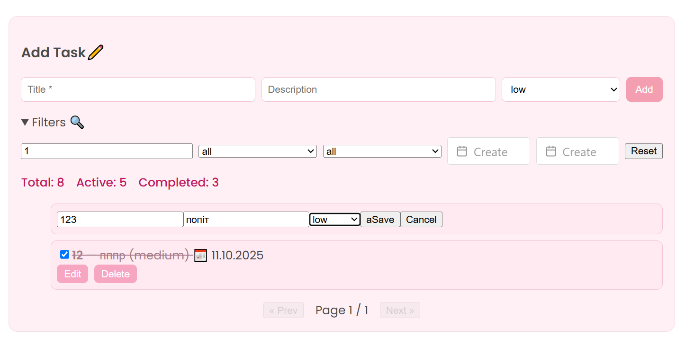
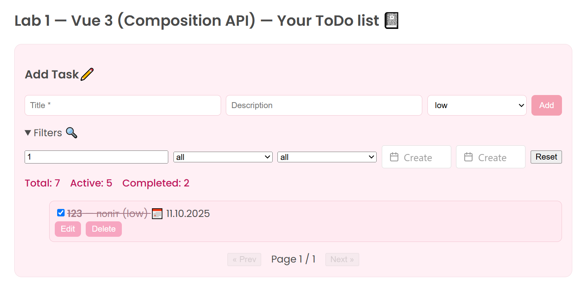
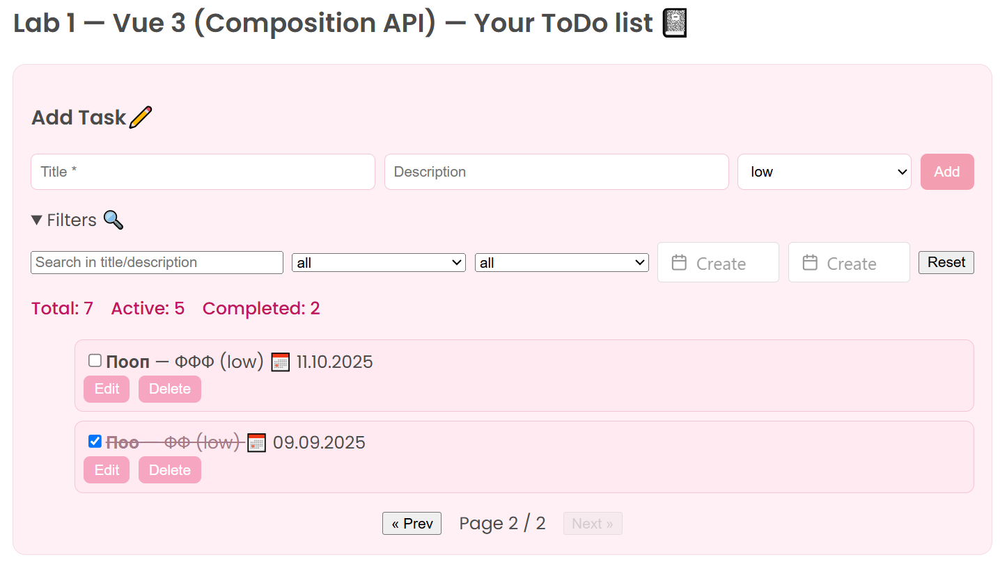

# Лабораторна робота №1 — Vue.js 3 (Composition API)

## Мета
Навчитися створювати та керувати реактивним станом у Vue 3 за допомогою **Composition API**.  
Опрацювати `ref`, `reactive`, `computed`, `watch`, директиви (`v-model`, `v-bind`, `v-on`, `v-for`, `v-if/else`, `v-show`) та відпрацювати базовий UX/UI для To-Do додатку.

---

## Запуск проєкту

1. Клонувати репозиторій та перейти в папку `lab1`:
```bash
git clone https://github.com/Anastasiialup/VueJSLabs2025
cd VueJSLabs2025/lab1
npm install
npm run dev
```

2. Відкрити проект у браузері за адресою, яку виведе Vite (зазвичай http://localhost:5173/).

Ось приклад як ми заповнюємо поля та додаємо 1 задачу



Дані автоматично оновлюються без оновлення сторінки, ми можемо побачити скільки тепер у нас завдань.
Нижче бачимо фільтри та можемо ними скористатися. Наприклад, відфільтрувати по назві, даті, статусу чи пріорітету.


Також ми можемо позначити задачі як виконані, чи повернути навпаки.


Ми можемо змінювати дані завдання та видаляти їх



На нашому сайті є пагінація, якщо завдань більше ніж 5, ми створюємо нову сторінку, де є як мінімум 1 завдання


На цьому демонстрація функціоналу завершена, переходимо далі.

Модель даних завдання
{
  id: string,           // Унікальний ідентифікатор
  title: string,        // Заголовок завдання
  description: string,  // Опис завдання
  status: 'active' | 'done', // Статус
  createdAt: string,    // Дата створення (ISO)
  priority: 'low' | 'medium' | 'high' // Пріоритет
}

3. Опис
Реактивність та логіка
ref:
const tasks = ref(load())
const newTitle = ref('')
const page = ref(1)

Використовується для простих реактивних змінних (список, форма, сторінка пагінації).
reactive:
const filters = reactive({
  text: '',
  status: 'all',
  priority: 'all',
  createdFrom: null,
  createdTo: null,
})


Об’єкт фільтрів для пошуку завдань.
computed:
const total = computed(() => tasks.value.length)
const activeCount = computed(() => tasks.value.filter(t => t.status === 'active').length)
const completedCount = computed(() => tasks.value.filter(t => t.status === 'done').length)


Лічильники загальної кількості, активних та виконаних завдань.

const filtered = computed(() => { ... })
Фільтр завдань за текстом, статусом, пріоритетом та датами.

const paged = computed(() => { ... })
Розбиває відфільтровані завдання на сторінки (пагінація).

watch:
watch(tasks, val => localStorage.setItem('tasks', JSON.stringify(val)), { deep: true })

Відстежує зміни у списку завдань і автоматично зберігає їх у LocalStorage.

Директиви Vue

v-model — двостороннє зв’язування з інпутами та select:

```bash
<input v-model="newTitle" />
<select v-model="newPriority">
```

v-on (@) — обробка подій:
```bash
<button @click="addTask">Add</button>
<input type="checkbox" @change="$emit('toggle', todo.id)" />
```

v-bind (:) — прив’язка атрибутів:
:checked="todo.status === 'done'"
:todo="t"
:key="t.id"


v-for — рендер списку:
```bash
<TodoItem v-for="t in paged" :key="t.id" :todo="t" />
```

v-if / v-else — умовне відображення:
```bash
<div v-if="!isEditing">...</div>
<div v-else>...</div>
```

Vue DevTools
Стан компонентів та реактивних змінних можна відстежувати через Vue DevTools:
tasks — список завдань
filters — поточні фільтри
total, activeCount, completedCount — computed властивості

UX/UI
Зручна форма додавання завдань.
Візуальна індикація виконаних завдань (клас done).
Можливість редагування та видалення завдань.
Пагінація для великої кількості елементів.
Фільтри з можливістю скидання.

4. Висновок
Лабораторна робота №1 дозволила закріпити базові навички роботи з Vue 3 (Composition API):
Реактивність (ref, reactive)
Похідні значення (computed)
Відстеження змін (watch)
Використання директив (v-model, v-on, v-bind, v-for, v-if/else)
Робота з LocalStorage
Створення структурованого, інтерактивного To-Do додатку з UX/UI
