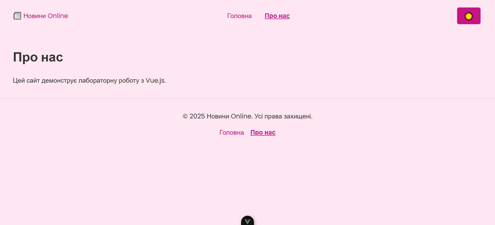
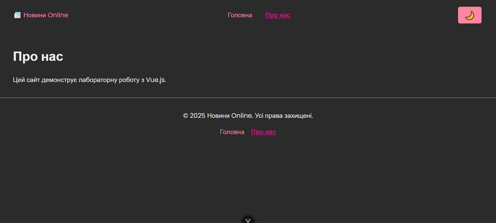
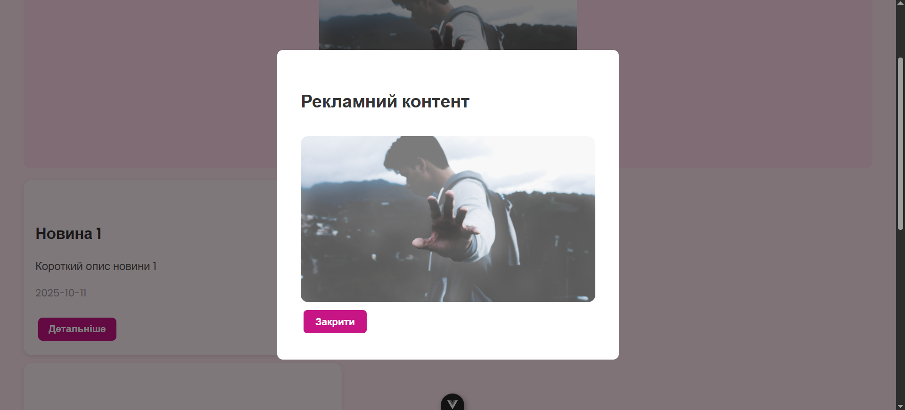
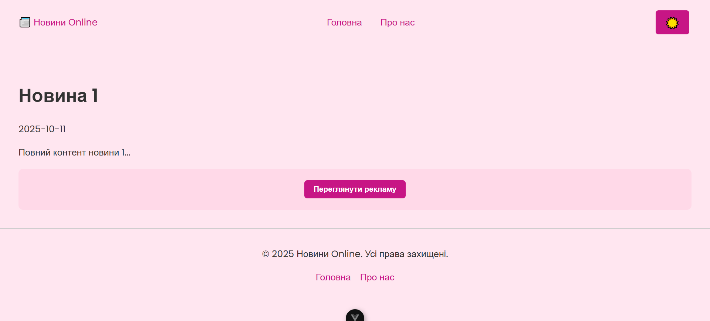

# Vue.js - Лабораторна робота №33 (Стилізація компонентів у Vue.js) Лупашина Анастасія ВТ-22-1

## Мета
Закріпити знання по роботі з Vue SFC стилями (`scoped`, CSS Modules, `v-bind()` у CSS / динамічні класи), навчитися застосовувати анімацію переходів та використовувати `<Teleport>`.

## Результат
Міні-сайт новин із:
- Хедером та футером
- Головною сторінкою списку новин
- Сторінкою повної новини
- Сторінкою “Про нас”
- Рекламними слотами та модальними вікнами
- Перемикачем теми (Light/Dark)
- Анімацією переходів між сторінками через `<Transition>`

---

## Структура проекту

```

lab3/
├─ index.html
├─ package.json
├─ vite.config.js
├─ src/
│  ├─ main.js
│  ├─ App.vue
│  ├─ assets/
│  │  └─ main.css
│  ├─ composables/useTheme.js
│  ├─ data/news.js
│  ├─ router/index.js
│  ├─ components/
│  │  ├─ Header.vue
│  │  ├─ Footer.vue
│  │  ├─ NewsCard.vue
│  │  ├─ AdSlot.vue
│  │  └─ ModalAd.vue
│  └─ pages/
│     ├─ Home.vue
│     ├─ Article.vue
│     ├─ About.vue
│     └─ NotFound.vue

````

---

## Інструкція запуску

1. Клонування репозиторію:
```bash
git clone https://github.com/<your-username>/VueJSLabs2025.git
cd VueJSLabs2025/lab3
````

2. Встановлення залежностей:

```bash
npm install
```

3. Запуск dev-сервера:

```bash
npm run dev
```

4. Відкрити у браузері: `http://localhost:5173`

---

## Скриншоти

* Головна сторінка - її відображення
* 
* Наступна вкладка - сторінка про нас
* * 
* Відображення з темною темою, яка зберігається в локал сторидж, навіть після перезавантаження сторінки
* * 
* Відображення відкритого можального вікна з рекламою, яка перекриває екран
* * 
* Відображення сторінки новини з її інформацією
* * 

---

## Код проекту

### main.js
Ініціалізація Vue додатку, підключення роутера та стилів, монтування в #app

```js
import { createApp } from 'vue'
import App from './App.vue'
import router from './router'
import './assets/main.css'

createApp(App).use(router).mount('#app')
```

### router/index.js
Налаштування роутів із історією браузера, скролом угору при переході і класом для активних посилань.

```js
import { createRouter, createWebHistory } from 'vue-router'
import Home from '../pages/Home.vue'
import Article from '../pages/Article.vue'
import About from '../pages/About.vue'
import NotFound from '../pages/NotFound.vue'

const routes = [
  { path: '/', component: Home },
  { path: '/article/:id', component: Article, props: true },
  { path: '/about', component: About },
  { path: '/:pathMatch(.*)*', component: NotFound }
]

const router = createRouter({
  history: createWebHistory(),
  routes,
  scrollBehavior() { return { top: 0 } },
  linkActiveClass: 'active-link'
})

export default router
```

### data/news.js
Локальні дані новин для рендерингу списку і детальної сторінки.

```js
export const news = [
  {
    id: 1,
    title: 'Новина 1',
    description: 'Короткий опис новини 1',
    content: 'Повний контент новини 1...',
    date: '2025-10-11',
    image: 'https://via.placeholder.com/400x200'
  },
  {
    id: 2,
    title: 'Новина 2',
    description: 'Короткий опис новини 2',
    content: 'Повний контент новини 2...',
    date: '2025-10-10',
    image: 'https://via.placeholder.com/400x200'
  },
  {
    id: 3,
    title: 'Новина 3',
    description: 'Короткий опис новини 3',
    content: 'Повний контент новини 3...',
    date: '2025-10-09',
    image: 'https://via.placeholder.com/400x200'
  },
]
```

### composables/useTheme.js
Хук для керування темою (Light/Dark) із збереженням у localStorage.

```js
import { ref, watchEffect } from 'vue'

const theme = ref(localStorage.getItem('theme') || 'light')

watchEffect(() => {
  document.documentElement.setAttribute('data-theme', theme.value)
  localStorage.setItem('theme', theme.value)
})

export function useTheme() {
  const toggle = () => theme.value = theme.value === 'light' ? 'dark' : 'light'
  return { theme, toggle }
}
```

### App.vue

```vue
<template>
  <Header />
  <main class="main-content">
    <RouterView v-slot="{ Component }">
      <Transition name="fade" mode="out-in">
        <component :is="Component" />
      </Transition>
    </RouterView>
  </main>
  <Footer />
</template>

<script setup>
import Header from './components/Header.vue'
import Footer from './components/Footer.vue'
</script>

<style scoped>
.main-content {
  padding: 1rem;
}
.fade-enter-active, .fade-leave-active {
  transition: opacity 0.5s;
}
.fade-enter-from, .fade-leave-to {
  opacity: 0;
}
</style>
```

### Header.vue

```vue
<template>
  <header>
    <h1>Новини</h1>
    <nav>
      <router-link to="/">Home</router-link>
      <router-link to="/about">About</router-link>
    </nav>
    <button @click="toggle">Тема</button>
  </header>
</template>

<script setup>
import { useTheme } from '../composables/useTheme.js'
const { toggle } = useTheme()
</script>

<style scoped>
header {
  display:flex;
  justify-content: space-between;
  align-items:center;
  padding:1rem;
  background:#f5f5f5;
}
nav a.active-link { font-weight:bold; }
</style>
```

### Footer.vue

```vue
<template>
  <footer>
    <p>© 2025 Новини</p>
  </footer>
</template>

<style scoped>
footer {
  text-align:center;
  padding:1rem;
  background:#f5f5f5;
  margin-top:1rem;
}
</style>
```

### NewsCard.vue (CSS Modules)

```vue
<template>
  <div :class="$style.card">
    
    <h2 :class="$style.title">{{ news.title }}</h2>
    <p>{{ news.description }}</p>
    <p>{{ news.date }}</p>
    <router-link :to="`/article/${news.id}`">
      <button :class="$style.button">Детальніше</button>
    </router-link>
  </div>
</template>

<script setup>
defineProps({ news: Object })
</script>

<style module src="./NewsCard.module.css"></style>
```

### NewsCard.module.css

```css
.card { max-width:400px; margin:1rem; border:1px solid #ccc; padding:1rem; border-radius:8px; }
.image { width:100%; border-radius:8px; }
.title { font-size:1.2rem; margin:0.5rem 0; }
.button { padding:0.5rem 1rem; cursor:pointer; border:none; background:#007BFF; color:white; border-radius:4px; }
```

### AdSlot.vue

```vue
<template>
  <div class="ad-slot"><slot></slot></div>
</template>

<style scoped>
.ad-slot { border:1px dashed #ccc; padding:1rem; margin:1rem 0; text-align:center; }
</style>
```

### ModalAd.vue

```vue
<template>
  <Teleport to="body">
    <transition name="fade">
      <div v-if="show" class="modal-overlay">
        <div class="modal">
          <slot></slot>
          <button @click="$emit('close')">Закрити</button>
        </div>
      </div>
    </transition>
  </Teleport>
</template>

<script setup>
defineProps(['show'])
</script>

<style scoped>
.modal-overlay { position: fixed; top:0; left:0; width:100%; height:100%; background: rgba(0,0,0,0.5); display:flex; justify-content:center; align-items:center; }
.modal { background:white; padding: 2rem; border-radius:8px; max-width:400px; width:90%; }
</style>
```

### pages/Home.vue

```vue
<template>
  <div>
    <AdSlot>
      <button @click="showAd = true">Переглянути рекламу</button>
    </AdSlot>
    <ModalAd :show="showAd" @close="showAd=false">
      <h2>Рекламний контент</h2>
      
    </ModalAd>
    <NewsCard v-for="item in news" :key="item.id" :news="item" />
  </div>
</template>

<script setup>
import { ref } from 'vue'
import NewsCard from '../components/NewsCard.vue'
import AdSlot from '../components/AdSlot.vue'
import ModalAd from '../components/ModalAd.vue'
import { news } from '../data/news.js'

const showAd = ref(false)
</script>
```

### pages/Article.vue

```vue
<template>
  <div v-if="article">
    
    <h1>{{ article.title }}</h1>
    <p>{{ article.date }}</p>
    <p>{{ article.content }}</p>
    <AdSlot>
      <button @click="showAd = true">Переглянути рекламу</button>
    </AdSlot>
    <ModalAd :show="showAd" @close="showAd=false">
      <h2>Рекламний контент у статті</h2>
      
    </ModalAd>
  </div>
</template>

<script setup>
import { ref } from 'vue'
import { useRoute } from 'vue-router'
import { news } from '../data/news.js'
import AdSlot from '../components/AdSlot.vue'
import ModalAd from '../components/ModalAd.vue'

const route = useRoute()
const article = news.find(n => n.id === Number(route.params.id))
const showAd = ref(false)
</script>
```

### pages/About.vue

```vue
<template>
  <div>
    <h1>Про нас</h1>
    <p>Це інформаційна сторінка.</p>
  </div>
</template>

<style scoped>
h1 { margin-bottom:1rem; }
</style>
```

### pages/NotFound.vue

```vue
<template>
  <div>
    <h1>404 — Сторінка не знайдена</h1>
    <router-link to="/">Повернутися на головну</router-link>
  </div>
</template>

<style scoped>
h1 { color:red; }
</style>
```

---

## Висновок

* У Vue.js можна легко локалізувати стилі через `<style scoped>` або CSS Modules.
* `<Transition>` + `<RouterView>` дозволяє робити плавні переходи між сторінками.
* `<Teleport>` зручно використовувати для модалок, банерів, нотифікацій.
* Перемикач теми та збереження у `localStorage` дозволяє покращити UX.

---
